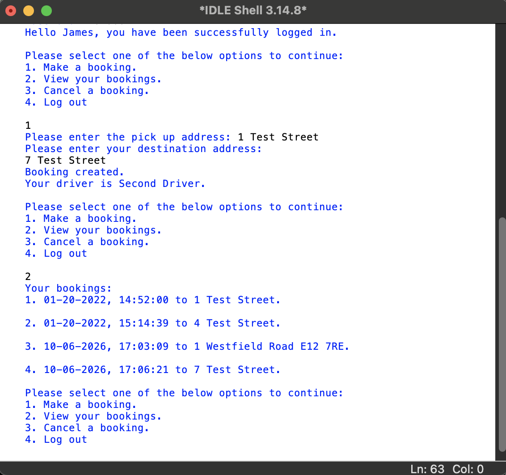
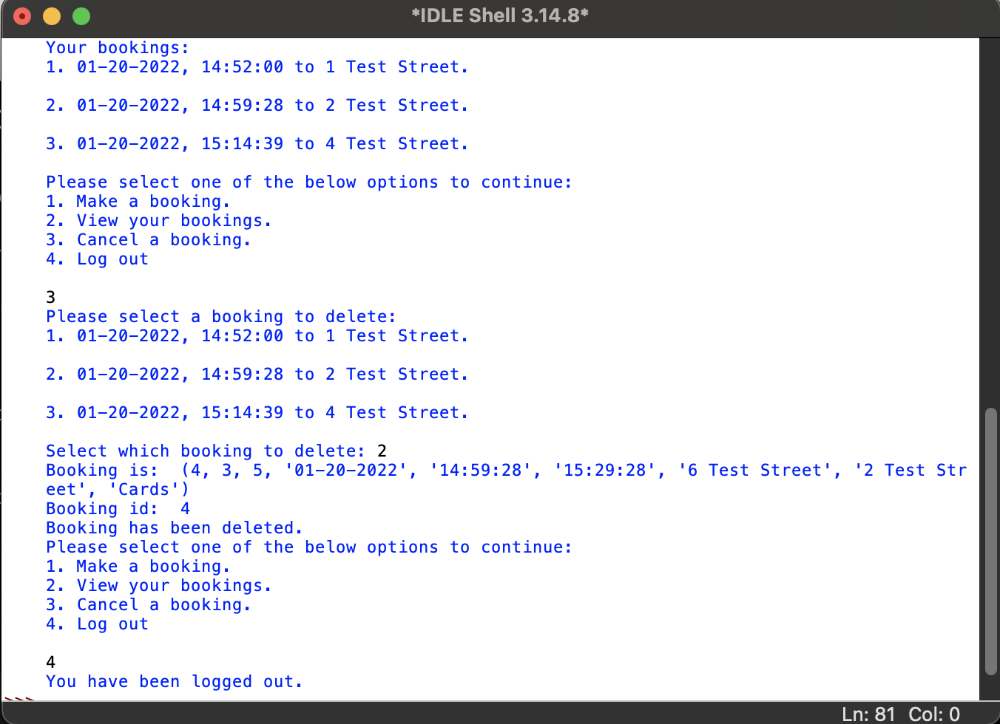
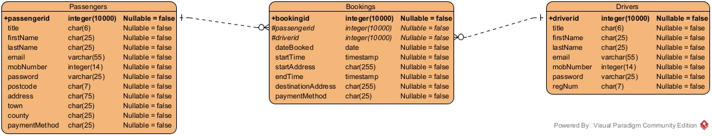
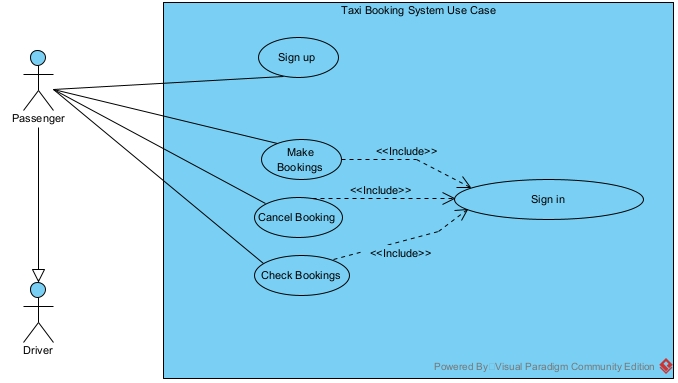
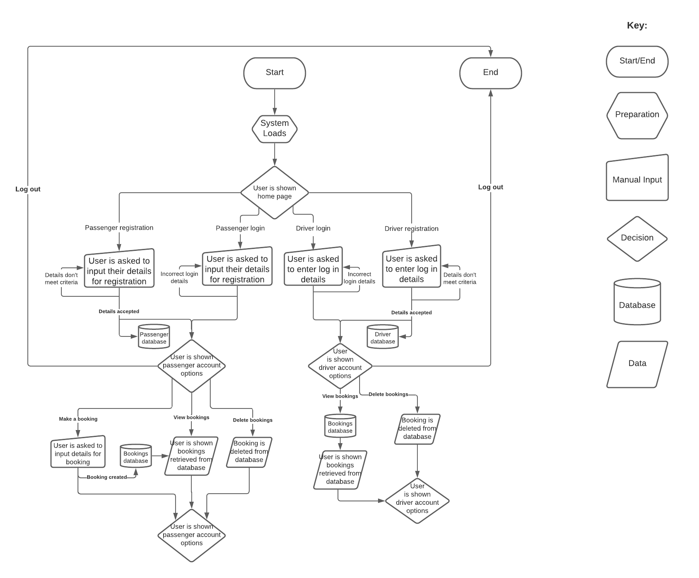

# 🚕 Python Taxi Booking System

A command-line taxi booking and management system developed using **Python and SQLite** as part of my Computer Science degree.

The project explores application logic, user authentication, input validation, relational database design and the management of taxi bookings across passenger and driver workflows.

> This repository preserves the project largely as it was originally submitted during my degree. The code therefore represents my development experience at that stage rather than my current approach to software engineering.

---

## 📖 About the Project

The Taxi Booking System was developed to model a simple taxi booking service with separate functionality for passengers and drivers.

Passengers can create an account, log in, create taxi bookings, view their existing bookings and cancel bookings. When a booking is created, the system allocates a driver and stores the booking using an SQLite database.

Drivers have their own registration and login flow and can view and manage bookings through the driver portal.

The project was supported by software and database design work including UML, entity relationship modelling and process mapping.

---

## ✨ Features

The application includes:

- Passenger registration and login
- Driver registration and login
- Separate passenger and driver workflows
- Email and password validation
- Taxi booking creation
- Automatic driver allocation when creating a booking
- Viewing existing bookings
- Cancelling bookings
- Driver booking management
- Persistent passenger, driver and booking data
- SQLite database integration

---

## 🛠️ Built With

- **Python**
- **SQLite**
- **SQL**
- Regular expressions
- Relational database design
- UML modelling
- Entity relationship modelling

---

## 📸 Application

### Passenger Booking

The passenger portal allows users to create bookings and view their existing bookings. A driver is allocated when a new booking is created.



### Booking Management

Bookings stored in the database can be retrieved, selected and cancelled through the application.



---

## 🗄️ Database Design

The application uses **SQLite** to persist passenger, driver and booking information.

Database operations are separated into a supporting Python module responsible for creating and interacting with the application's data.

### Entity Relationship Model



---

## 📐 Software Design

UML and process modelling were used during the design of the application to plan its users, functionality and application flow.

### UML Diagram



### Process Map



---

## 📂 Repository Structure

```text
python-taxi-booking-system/
│
├── src/
│   ├── taxi_booking_system.py
│   ├── taxidatabase.py
│   └── taxidata.db
│
├── docs/
│   ├── passenger-booking.png
│   ├── booking-management.png
│   ├── taxi-booking-system-uml.jpg
│   ├── taxi-booking-system-erm.jpg
│   └── process-map.png
│
├── README.md
└── .gitignore
```

---

## ▶️ Running the Project

The application is a command-line Python program using SQLite for data storage.

Clone the repository:

```bash
git clone https://github.com/NunoQPS/python-taxi-booking-system.git
```

Navigate to the source directory:

```bash
cd python-taxi-booking-system/src
```

Run the application:

```bash
python taxi_booking_system.py
```

The project was originally developed using an earlier version of Python. When running it on newer Python versions, compatibility warnings may be displayed for some syntax used in the original implementation.

The application has been successfully run against **Python 3.14** while preparing this repository.

---

## 🎓 Project Background

This project was originally developed as university coursework during my Computer Science degree.

It provided practical experience connecting application logic to a relational database and designing software around multiple user roles and workflows.

The project also gave me experience with:

- Designing a relational data model
- Writing SQL-backed application functionality
- Separating database operations from the main application
- Validating user input
- Modelling software using UML and entity relationship diagrams
- Developing different application flows based on user roles

The original implementation has intentionally been preserved rather than rewritten using my current knowledge.

This allows the repository to represent the stage I was at when the project was completed and forms part of the wider progression shown across my portfolio.

---

## 💭 What I'd Improve Today

Looking back at this project with the software engineering experience I've developed since completing it, there are several areas I would approach differently today.

I would:

- Introduce a clearer object-oriented domain model
- Separate the user interface, business logic and data-access responsibilities more clearly
- Use a more structured database access layer
- Improve exception handling and user feedback
- Strengthen authentication and password storage
- Expand and centralise input validation
- Add automated unit and integration tests
- Introduce configuration management where appropriate
- Apply more consistent Python naming and formatting conventions
- Improve database constraints and data integrity
- Use Git throughout development rather than relying on separate local versions

These improvements reflect how my approach to designing and maintaining software has developed since completing the original project.

---

## 🔄 Development Journey

I have intentionally kept this project close to its original university implementation rather than retrospectively rewriting it to appear more modern.

My current projects apply many of the practices I would now introduce here, including stronger separation of responsibilities, source control throughout development, structured data modelling and a more deliberate development process.

This repository therefore serves both as a working software project and as a record of an earlier stage in my development journey.
